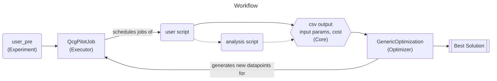
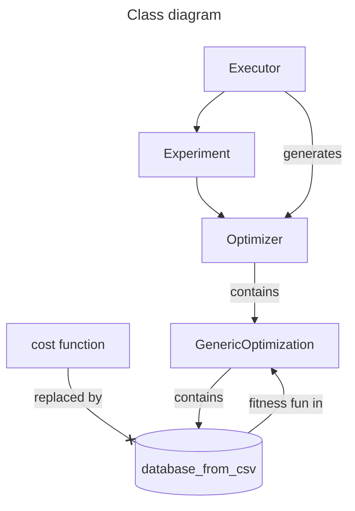

[](https://pypi.org/project/yotse)


[](https://coveralls.io/github/SURFQuantum/yotse?branch=main)


# YOTSE - Your Optimization Tool for Scientific Experiments
<div style="text-align:center;">
    
</div>


YOTSE is a powerful tool designed to enable computational experiments using any software, with a particular emphasis on NetSquid in the context of the Quantum Internet Alliance. This library offers a set of predefined functions for performing parameter explorations and optimizations in a scalable and efficient manner.

Documentation can be found [here](https://surfquantum.github.io/yotse/).

Note: If you use this package for research purposes, consider checking out the underlying optimization libraries and citing them.

## Table of Contents
1. [Installation](#installation)
2. [Usage](#usage)
3. [Contributing](#contributing)
4. [Testing](#testing)
5. [License](#license)

## Installation
### Python Package

To install this project, simply:
```bash
pip install yotse
```
### Manual
If you want to contribute to the project, then clone the repository as follows: (Make sure you have the necessary permissions.)

```bash
git clone https://github.com/SURFQuantum/yotse.git
```

Once the repository is cloned, navigate to the project's root directory, with:

```bash
cd yotse
```
If you do not have [poetry](https://python-poetry.org/docs/) already installed you need will need  to [install](https://python-poetry.org/docs/#installation) it first.
Then install yotse using:

```bash
poetry install
```
To verify your installation you can now do:

```bash
poetry run tests && poetry run examples
```

## Usage

### General

YOTSE is versatile, catering to a wide range of software. While it has a special focus on NetSquid, it is flexible enough to accommodate any software you wish to use for your computational experiments.

Our library offers predefined functions for parameter exploration and optimization. We base our tools on the QCG-PilotJob project, a job manager executable both locally and in HPC centers. You can find more information about QCG-PilotJob in their [official docs](https://qcg-pilotjob.readthedocs.io/en/develop/) or in the [original paper](https://doi.org/10.1007/978-3-030-77977-1_39).

The optimization component of YOTSE involves a base class that can be used with any external optimization library. This flexibility allows you to tailor your optimization process to your specific needs and preferences.

Detailed examples of usage are provided in the `/examples` directory.



### Usage with SLURM

In order to make usage with HPC resources and [SLURM](https://slurm.schedmd.com/documentation.html) as smooth and simple as possible, yotse can generate its own SLURM files ready for execution.

Simply specify your SLURM parameters (such as required nodes or time) and modules to be imported in the `SystemSetup` and then execute
```bash
python <your_yotse_script.py> --slurm
```
This will generate a SLURM script for your (default name: `slurm.job`) which you can then submit by:
```bash
sbatch slurm.job
```
In order to keep dependencies as clean as possible, we suggest using two virtual environments for SLURM execution:
1. A virtual environment that has all dependencies of your own script installed and can execute your owns script without errors. Pass this as `SystemSetup.venv`.
2. A virtual environment that has `yotse` installed. Pass this as `SystemSetup.slurm_venv` such that it is activated before SLURM executes the yotse commands.

## Class structure



## Contributing

We appreciate contributions. To contribute:
1. Fork the project
2. Create your feature branch (`git checkout -b feature/MyNewFeature`)
3. Commit your changes (`git commit -am 'Add some feature'`)
4. Push to the branch (`git push origin feature/MyNewFeature`)
5. Execute ```make verify``` to check if your changes pass the required checks
6. Open a Pull Request

## Testing

To run tests on the project, navigate to the project's root directory and:

```bash
poetry run tests
```
If you want to open the coverage report do:
```bash
poetry run show-cov
```
and the coverage report should open in your default browser.

To run the examples, in the root directory execute
```bash
poetry run examples
```

## License

This project is licensed under the terms of the Apache License 2.0. For more details, refer to the LICENSE file in the project root.
