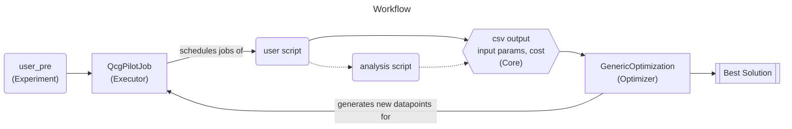
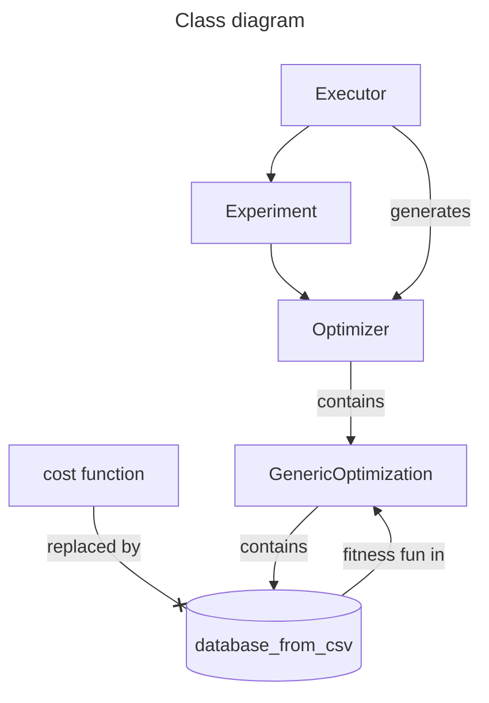

[](https://pypi.org/project/yotse)


# YOTSE - Your Optimization Tool for Scientific Experiments
<p align="center">

</p>

YOTSE is a powerful tool designed to enable computational experiments using any software, with a particular emphasis on NetSquid in the context of the Quantum Internet Alliance. This library offers a set of predefined functions for performing parameter explorations and optimizations in a scalable and efficient manner.

## Table of Contents
1. [Installation](#installation)
2. [Usage](#usage)
3. [Contributing](#contributing)
4. [Testing](#testing)
5. [License](#license)

## Installation

To install this project, clone the repository. Make sure you have the necessary permissions.

```bash
git clone https://github.com/SURFQuantum/yotse.git
```

Once the repository is cloned, navigate to the project's root directory.

```bash
cd yotse
```

Install any necessary dependencies as per the project's documentation.

## Usage

YOTSE is versatile, catering to a wide range of software. While it has a special focus on NetSquid, it is flexible enough to accommodate any software you wish to use for your computational experiments.

Our library offers predefined functions for parameter exploration and optimization. We base our tools on the QCG-Pilotjob project, a job manager executable both locally and in HPC centers. You can find more information about QCG-Pilotjob here.

The optimization component of YOTSE involves a base class that can be used with any external optimization library. This flexibility allows you to tailor your optimization process to your specific needs and preferences.

Detailed examples of usage will be provided in the /examples directory.



## Current structure



## Contributing

We appreciate contributions. To contribute:
1. Fork the project
2. Create your feature branch (`git checkout -b feature/MyNewFeature`)
3. Commit your changes (`git commit -am 'Add some feature'`)
4. Push to the branch (`git push origin feature/MyNewFeature`)
5. Execute ```make verify``` to check if your changes pass the required checks
6. Open a Pull Request

## Testing

To run tests on the project, navigate to the project's root directory and use the make test command.

```bash
make test
```
or
```bash
make test-cov
```
to test coverage.

To run the examples, in the root directory execute
```bash
make example
```

## License

This project is licensed under the terms of the Apache License 2.0. For more details, refer to the LICENSE file in the project root.
